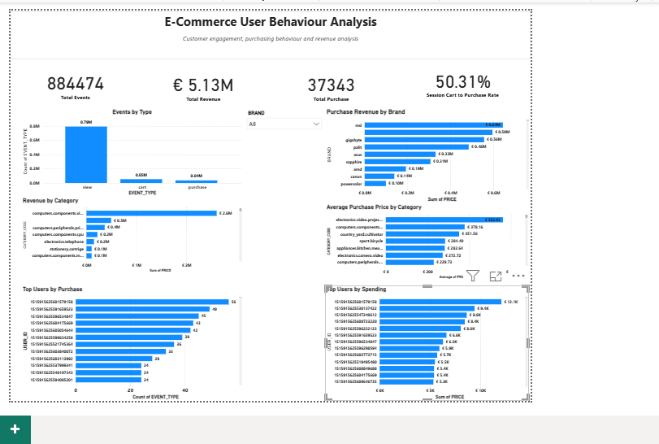

# E-commerce User Behaviour Analysis

E-commerce user behaviour analysis using Snowflake, SQL and Power BI.

## Project Overview

This project analyses e-commerce event data to understand customer engagement, purchasing behaviour, revenue patterns and product performance.

The analysis was performed using SQL in Snowflake, with the results presented through a Power BI dashboard.

The project focuses on transforming raw e-commerce event data into validated, business-focused insights.

## Technologies Used

- Snowflake
- SQL
- Power BI
- GitHub

## Dataset

The dataset contains e-commerce user events including:

- Product views
- Add-to-cart events
- Purchases
- Product categories
- Brands
- Prices
- User IDs
- User sessions

The CSV data was loaded into Snowflake using the Snowflake interface.

### Raw Data

The raw data is stored in:

`ECOMMERCE_USER_BEHAVIOUR.RAW.EVENTS_RAW`

The SQL exploration queries use this raw table to examine:

- Total events
- Unique users
- Unique products
- Unique sessions
- Event-type distribution
- Event percentages
- Sample records

## Data Preparation

The project follows a raw-to-cleaned workflow:

`RAW.EVENTS_RAW`
→ `CLEANED.EVENTS_CLEAN`
→ `CLEANED.EVENTS_CLEAN_FINAL`

The cleaned final table is used for the main analysis and dashboard calculations.

The preparation process includes validation of event types, prices, missing values and other fields required for analysis.

The SQL used for the preparation and analysis is available in the `sql` folder.

## SQL Analysis

The SQL analysis includes:

- Data exploration and validation
- Data cleaning
- Filtering with `WHERE`
- Aggregation using `SUM`, `AVG` and `COUNT`
- Grouping using `GROUP BY`
- Sorting and ranking
- Missing-value checks
- Revenue analysis
- Brand analysis
- Category analysis
- Customer purchasing behaviour
- Funnel analysis
- Session-level conversion analysis
- Revenue reconciliation

The project also uses CTEs, conditional aggregation and a LEFT JOIN validation approach to cross-check the session-level funnel calculation.

## Funnel Analysis

A key part of the project was investigating the difference between an event-level and session-level cart-to-purchase metric.

### Event-Level Metric

The original event-level calculation produced:

**69.11%**

This compares recorded purchase and cart events.

This is an event-level measure and does not show how many customer sessions progressed from cart to purchase.

### Session-Level Metric

A session-level funnel was then created using `user_session`.

The resulting rate is:

**50.31%**

This measures the proportion of sessions containing a cart event that also contained a purchase event.

The Power BI dashboard therefore uses:

**Session Cart to Purchase Rate: 50.31%**

The result was validated using two approaches:

1. CTE and conditional aggregation
2. LEFT JOIN-based validation

Both approaches produce the same session-level result.

This demonstrates why the level of analysis and metric definition are important when interpreting conversion rates.

## Revenue Reconciliation

The project also investigated a difference between price totals across all event types and revenue generated specifically from purchase events.

Views and cart events should not be interpreted as completed revenue, so the final dashboard revenue measure is based on purchase events only.

### Final Purchase Revenue

**€5,125,113.92**

Displayed in Power BI as:

**€5.13M**

### Purchase Events

**37,343**

## Power BI Dashboard

The Power BI dashboard presents the main results from the Snowflake analysis.

### Dashboard KPIs

| Metric | Result |
|---|---:|
| Total Events | 884,474 |
| Total Revenue | €5.13M |
| Total Purchases | 37,343 |
| Session Cart to Purchase Rate | 50.31% |

The Total Revenue KPI represents purchase-only revenue.

## Customer Engagement

The dataset contains approximately:

- **790K view events**
- **50K cart events**
- **40K purchase events**

Product views account for the majority of recorded activity, with fewer events progressing through cart and purchase stages.

## Purchase Revenue by Brand

The dashboard uses purchase events for the brand revenue analysis.

| Brand | Purchase Revenue |
|---|---:|
| MSI | €0.64M |
| Gigabyte | €0.59M |
| Palit | €0.48M |
| ASUS | €0.33M |
| Sapphire | €0.31M |
| AMD | €0.19M |
| Canon | €0.14M |
| PowerColor | €0.10M |

## Revenue by Category

The corrected purchase-focused analysis shows the strongest category at approximately:

**€2.6M**

Other leading categories include approximately:

- €0.5M
- €0.4M
- €0.2M
- €0.2M
- €0.1M
- €0.1M

Computer and electronics-related categories account for a significant proportion of purchase revenue.

## Average Purchase Price by Category

The highest average purchase prices shown in the dashboard include:

| Category | Average Purchase Price |
|---|---:|
| Electronics video/projectors | €562.03 |
| Computers components | €378.16 |
| Country yard cultivator | €351.56 |
| Sport bicycle | €284.40 |
| Appliances kitchen | €282.64 |
| Electronics camera/video | €272.72 |
| Computers peripherals | €229.73 |

## Top Users by Purchases

The highest purchasing user recorded:

**56 purchases**

Other high-volume users recorded:

- 49 purchases
- 45 purchases
- 43 purchases
- 42 purchases
- 39 purchases
- 36 purchases
- 33 purchases

## Top Users by Spending

The highest-spending user recorded approximately:

**€12.1K**

Other high-spending users recorded approximately:

- €9.4K
- €8.6K
- €8.4K
- €8.0K
- €6.6K
- €6.3K
- €5.9K
- €5.7K
- €5.5K

## Key Findings

1. Product views dominate customer activity, with approximately 790K view events compared with around 50K cart events and 40K purchase events.

2. The original event-level cart-to-purchase calculation produced 69.11%, while the session-level calculation produced 50.31%.

3. The session-level metric is used for the final dashboard because it measures cart-to-purchase progression at the customer-session level.

4. Purchase revenue is €5.13M across 37,343 purchase events.

5. MSI and Gigabyte record the highest purchase revenue among the brands shown in the corrected dashboard.

6. Computer and electronics-related categories represent a significant proportion of purchase revenue.

7. Average purchase prices vary substantially between categories, with the highest average shown at €562.03.

8. A small number of users show particularly high purchasing activity, with the highest user recording 56 purchases.

9. High-spending customers can also be identified, with the highest-spending user recording approximately €12.1K.

## Business Value

This analysis demonstrates how e-commerce event data can be transformed into useful business information.

The analysis can help businesses:

- Understand customer behaviour
- Identify purchasing patterns
- Compare brands and product categories
- Identify high-value customers
- Monitor funnel progression
- Evaluate conversion metrics
- Validate revenue calculations
- Support data-driven commercial decisions

## Repository Structure

sql/
├── 01_dBase_setup.sql
├── 02_data_exploration.sql
├── 03_data_cleaniong.sql
├── 04_data_analysis.sql
├── 04b_funnel_comparison.sql
├── 05_funnel_analysis.sql
└── 06_revenue_reconciliation.sql

E_Commerce_PowerBi_Dashboard.PNG
E-commerce_user_behavior_Dashboard.pdf
README.md

## Dashboard

[View the Power BI Dashboard PDF](E-commerce_user_behavior_Dashboard.pdf)

## AI Assistance

AI assistance was used during development for some coding help, debugging and documentation.

The analysis, results and final changes were reviewed and completed by me.
